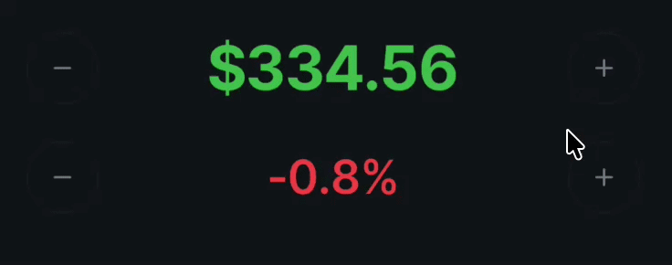
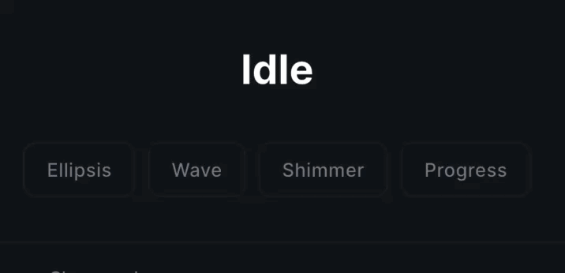

# rolling_text

[](https://pub.dev/packages/rolling_text)
[](https://pub.dev/packages/rolling_text/score)
[](LICENSE)


---

**Spring-physics slot animation for any Flutter text.**

Each character rolls through a clipped vertical cell with real spring physics —
old glyph exits, new one springs in with a subtle bounce. Works on **numbers,
labels, status strings, CTAs, countdowns** — any text that changes.

---

## Features

- Animates **any string** — not just numbers
- Real **spring physics** per character (mass, stiffness, damping)
- Per-character **stagger** and spring **personality variance** (`bounce`)
- **Direction-aware** number rolling — auto ↑/↓ from value delta
- **Width transitions** — length changes animate per slot
- **Chromatic** tints during roll-in + **resting color** per character
- **Odometer fade edges** (`fadeEdges`) for slot-machine depth
- Programmatic **controller** with `set()` / `flash()` (spam-safe auto-revert)
- **Waiting & Progress** loops (`ellipsis`, `wave`, `shimmer`, `builder`, `frames`)
- **Reduced Motion** accessibility (`respectDisableAnimations`)
- `RollingNumber` with `prefix`, `suffix`, `thousandSeparator`, `decimalSeparator`
- `skipUnchanged` — only animates characters that actually changed
- Zero dependencies

---

## Quick start

```dart
import 'package:rolling_text/rolling_text.dart';
```

### Reactive text — any string

```dart
RollingText(
  text: copied ? 'Copied ✓' : 'Copy',
  style: TextStyle(fontSize: 16, fontWeight: FontWeight.w600),
  options: RollingTextOptions(direction: RollingDirection.up),
)
```

### Number roller (direction-aware)

The `RollingNumber` widget automatically rolls **up** when the value increases
and **down** when it decreases — no manual wiring needed.

```dart
RollingNumber(
  value: _score,             // int or double
  style: TextStyle(fontSize: 48, fontWeight: FontWeight.bold),
)
```

With decimal precision, prefix and suffix:

```dart
RollingNumber(
  value: _price,
  fractionDigits: 2,
  prefix: '\$',
  style: TextStyle(fontSize: 32, color: Colors.green),
)

RollingNumber(
  value: _percentage,
  fractionDigits: 1,
  suffix: '%',
  style: TextStyle(fontSize: 28),
)
```

With zero-padding (like a classic counter):

```dart
RollingNumber(
  value: _count,
  wholePartPadding: 3,       // 7 → "007"
  style: TextStyle(fontSize: 52, fontFeatures: [FontFeature.tabularFigures()]),
)
```

Hide the leading zeros visually (slot animates in when new digits appear):

```dart
RollingNumber(
  value: _count,
  wholePartPadding: 3,       // pads internally for alignment
  hideLeadingZeroes: true,   // 7 → "7" visually (not "007")
  style: TextStyle(fontSize: 52),
)
```

> ⚠️ `hideLeadingZeroes` does **not** pre-allocate hidden slot space. When
> the value crosses a digit boundary (e.g. 99 → 100), the new hundreds slot
> rolls in from scratch. If you need silent pre-allocation, keep
> `hideLeadingZeroes: false` and style the zeros transparently instead.

Negative values are handled automatically — sign character animates too.

With thousand separators:

```dart
RollingNumber(
  value: _amount,
  thousandSeparator: ',',    // 1234567 → "1,234,567"
  fractionDigits: 2,
  prefix: '\$',
  style: TextStyle(fontSize: 32),
)
```

European-style formatting:

```dart
RollingNumber(
  value: _price,
  thousandSeparator: '.',    // 1234567 → "1.234.567"
  decimalSeparator: ',',     // 3.14 → "3,14"
  fractionDigits: 2,
  style: TextStyle(fontSize: 32),
)
```

### Odometer / slot-machine depth (fadeEdges)

Fades the top and bottom edges of each character cell to create an
odometer-style depth effect. Set `fadeEdges` in `RollingTextOptions`.

```dart
RollingNumber(
  value: _score,
  options: RollingTextOptions(
    fadeEdges: 0.20,         // fade top/bottom 20% of each slot cell
    springStiffness: 220,
    springDamping: 18,
  ),
  style: TextStyle(fontSize: 52, fontWeight: FontWeight.w700),
)
```



### Programmatic controller

```dart
final ctrl = RollingTextController(initial: 'Copy');

// In your widget tree:
RollingText(controller: ctrl, style: TextStyle(fontSize: 16));

// On interaction:
ctrl.flash('Copied ✓');     // rolls back after 1.4 s, spam-safe
ctrl.flash('Saved ✓', revertAfter: Duration(seconds: 2));
ctrl.set('Saved');           // permanent, cancels any pending revert
```

### Chromatic rainbow

The `color` tint fires during roll-in and fades back to the resting color after
each character settles. Only animating characters show the tint.

```dart
// Tint during animation, returns to style.color at rest:
RollingTextOptions(color: chromatic(from: 200, spread: 280))

// Permanent rainbow on static text (no animation needed):
RollingTextOptions(restingColor: chromatic())

// Roll-in tint that settles into a different permanent palette:
RollingTextOptions(
  color: chromatic(from: 0, spread: 320),        // fires during animation
  restingColor: chromatic(from: 180, spread: 90), // stays at rest
)

// Custom per-character color (brand gradient, etc.):
RollingTextOptions(
  restingColor: (index, total) {
    final t = total <= 1 ? 0.0 : index / (total - 1);
    return Color.lerp(Colors.blue, Colors.purple, t)!;
  },
)
```


You can pass any `Color Function(int index, int total)` to `color` or
`restingColor` — `chromatic()` is just a convenience helper.

---

### Stagger & direction

Each character animates independently with a configurable delay between slots,
creating a natural ripple. `bounce` adds spring personality variance per character.

```dart
RollingText(
  text: _label,
  style: TextStyle(fontSize: 32, fontWeight: FontWeight.w700),
  options: RollingTextOptions(
    direction: RollingDirection.up,
    stagger: Duration(milliseconds: 40),
    bounce: 0.8,
  ),
)
```


---

### Waiting & Progress Loops

Use the controller to trigger asynchronous status loops (like network loaders, file saves, or download trackers).



```dart
final ctrl = RollingTextController(initial: 'Idle');

// 1. Ellipsis loop ("Loading" -> "Loading." -> "Loading.." -> "Loading...")
final handle = ctrl.startWaiting('Loading', waiting: RollingWaiting.ellipsis());

// 2. Wave loop (Characters vertically roll to themselves in a spring-driven ripple)
final handle = ctrl.startWaiting('Processing', waiting: RollingWaiting.wave());

// 3. Shimmer loop (Text stays still; a color spotlight tint travels left-to-right)
final handle = ctrl.startWaiting('Saving data', waiting: RollingWaiting.shimmer(color: Colors.amber));

// 4. Progress loop (Iterates through a list of custom frames periodically)
final handle = ctrl.startProgress('Download', frames: ['Step 1/3', 'Step 2/3', 'Step 3/3']);

// Complete the loop with a success or failure text
handle.complete('Success ✓');
handle.fail('Error ✗', options: RollingTextOptions(color: chromatic(from: 0, spread: 20)));
```

---

## API

### `RollingText`

| Parameter | Type | Default | Description |
|---|---|---|---|
| `text` | `String?` | — | Text to animate. Changing triggers animation. |
| `controller` | `RollingTextController?` | `null` | Programmatic control. Overrides `text`. |
| `style` | `TextStyle` | **required** | Applied to all characters. |
| `options` | `RollingTextOptions` | `RollingTextOptions()` | Animation configuration. |
| `spacing` | `double` | `0.0` | Extra horizontal gap between character slots (logical pixels). |
| `respectDisableAnimations` | `bool` | `true` | Skip spring animation and snap directly to destination if reduced motion is enabled at OS level. |

### `RollingNumber`

| Parameter | Type | Default | Description |
|---|---|---|---|
| `value` | `num` | **required** | Integer or double to display. |
| `style` | `TextStyle` | **required** | Applied to the number. |
| `fractionDigits` | `int` | `0` | Decimal places (e.g. `2` → `"3.14"`). |
| `prefix` | `String?` | `null` | Static text before number (e.g. `'$'`). |
| `suffix` | `String?` | `null` | Static text after number (e.g. `'%'`). |
| `wholePartPadding` | `int` | `0` | Zero-pad whole part to N digits. |
| `hideLeadingZeroes` | `bool` | `false` | Strip leading zeros added by `wholePartPadding`. |
| `positiveSign` | `bool` | `false` | Show `+` for positive values. |
| `thousandSeparator` | `String?` | `null` | Separator between digit groups (e.g. `','` → `"1,000,000"`). |
| `decimalSeparator` | `String` | `'.'` | Decimal point character (e.g. `','` for European formatting). |
| `autoDirection` | `bool` | `true` | Auto-compute roll direction from value changes. |
| `options` | `RollingTextOptions?` | auto | Animation config. Direction is auto-computed when `autoDirection` is `true`. |

### `RollingTextOptions`

| Option | Type | Default | Description |
|---|---|---|---|
| `direction` | `RollingDirection` | `down` | `up` — enter from below; `down` — from above. |
| `stagger` | `Duration` | `45ms` | Extra delay per character index. |
| `duration` | `Duration` | `300ms` | Slide duration per character. |
| `exitOffset` | `Duration` | `50ms` | Entering glyph trails exiting by this much. |
| `bounce` | `double` (0–1) | `0.6` | Spring personality variance per character. |
| `springMass` | `double` | `1.0` | Spring inertia (higher = heavier feel). |
| `springStiffness` | `double` | `200.0` | Snap speed (higher = snappier). |
| `springDamping` | `double` | `22.0` | Damping (lower = more overshoot). |
| `color` | `Color Function(int, int)?` | `null` | Per-character tint **during** roll-in. Fades to `restingColor` or `style.color` after settling. Use `chromatic()`. |
| `restingColor` | `Color Function(int, int)?` | `null` | Per-character color **at rest**. Applied permanently; not tied to animation. Use `chromatic()` for rainbow static text. |
| `colorFadeDuration` | `Duration` | `280ms` | Time for the chromatic tint to fade to its resting color. |
| `skipUnchanged` | `bool` | `true` | Skip animating identical chars at same index. |
| `interrupt` | `bool` | `true` | New animations interrupt in-flight ones. |
| `fadeEdges` | `double` (0–0.5) | `0.0` | Fraction of cell height faded at top/bottom (odometer effect). |

### `RollingTextController`

Always create the controller in a `StatefulWidget` and dispose it:

```dart
class _MyWidgetState extends State<MyWidget> {
  late final RollingTextController _ctrl;

  @override
  void initState() {
    super.initState();
    _ctrl = RollingTextController(initial: 'Copy');
  }

  @override
  void dispose() {
    _ctrl.dispose();  // ← required, cancels pending timers
    super.dispose();
  }

  @override
  Widget build(BuildContext context) {
    return GestureDetector(
      onTap: () => _ctrl.flash('Copied ✓'),
      child: RollingText(controller: _ctrl, style: TextStyle(fontSize: 16)),
    );
  }
}
```
